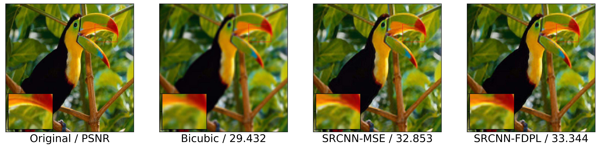

# FDPL

This repo holds my code for a novel loss function for super resolution, which operates in the frequency domain.
Please see the [accompanying paper](Freq_Domain_based_Perceptual_Loss.pdf) (*under review*) for full project details.


This repository includes an implementation of SRCNN and models trained with Mean Square Error (MSE) and FDPL for 3x super resolution.
The included model was trained on the BSDS500 training and validation sets. The BSDS500 test set
was used as a validation set. As a test set I use the popular Set5 images, which were also used
in the original SRCNN paper to demonstrate their results. The following is a selection of results comparing SRCNN trained with MSE to FDPL, with bicubic interpolation as a baseline:





## Contents
This repository provides:
- [SRCNNs] trained with MSE and FDPL for 3x super-resolution (models/)
- [Code to generate] the training and validation sets (src/data/build_sr_dataset.py)
- The [notebook used to train the model] from scratch (notebooks/SR_with_MSE_loss.ipynb)
- A [notebook] to visualize the first conv. layer kernels (src/visualization/visualize_kernels.ipynb)
- A [notebook] to generate demo images (src/visualization/generate_images.ipynb)


## Setup
All code is implemented in Python and Pytorch.

First install the project dependencies:

```bash
pip install -r requirements.txt
```

Then download a dataset and move it to [data/raw/] (data/raw/)

Build the training and validation datasets as follows:

```bash
python3 src/data/build_sr_dataset.py <path_to_train_images/> <data/train/file_name.hdf5> <super_resolution_factor>

python3 src/data/build_sr_dataset.py <path_to_val_images/> <data/val/file_name.hdf5> <super_resolution_factor>
```

Train the model by running the [training notebook] (./notebooks/SR_with_MSE_loss.ipynb)

## Watch Learning Progression

Start TensorBoard on localhost:8898 after training has started
